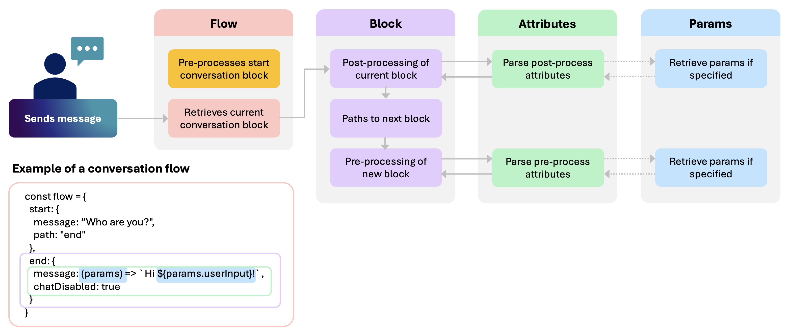
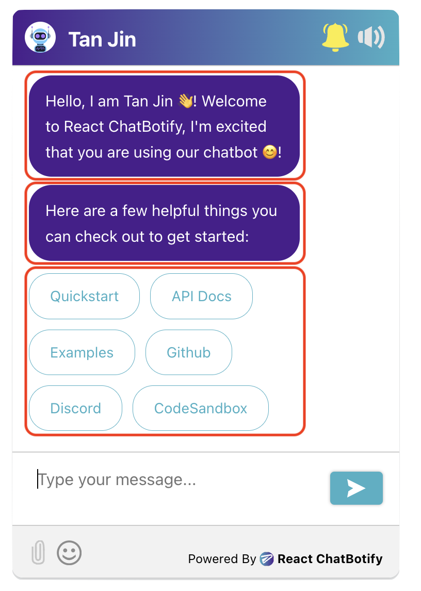
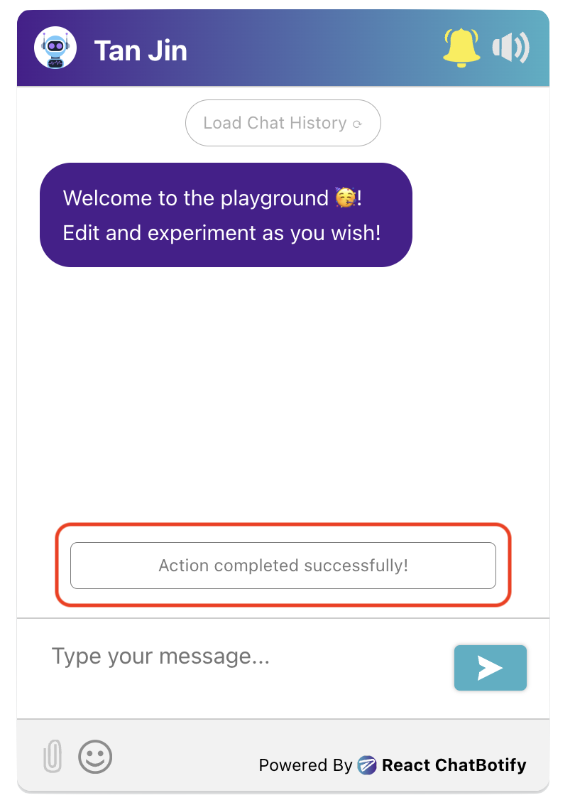

# Conversations

Conversations refer to the interactions between the bot and the user. Here's how a basic conversation may look like:

```jsx
const flow = {
  start: {
    message: "Who are you?",
    path: "end"
  },
  end: {
    message: (params) => `Hi ${params.userInput}!`,
    chatDisabled: true
  }
}
```

In a conversation, there are 4 important properties to take note of and they are the **Flow** (conversation flow), **Block** (conversation block), **Attributes** and **Params**. Below,
we observe how these properties interact with each other:



We will walk through the short example code snippet above to give you a better idea of a conversation flow:

1. Upon the start of a conversation flow, the chatbot **immediately pre-processes** the `start` block. In the example above, the `message` attribute is processed and the message *"Who are you?"* is sent by the bot into the chat. Following which, it patiently waits for a user input.
2. When the user sends a message (or uploads a file), the **current block** is retrieved and **post-processing** is done for it. If a next path is found during **post-processing**, the conversation flow moves to the next block. In the example above, the flow moves into the `end` block as specified by the `path` attribute.
3. Upon entering a new block (`end` block in this case), **pre-processing** of attributes are immediately done. The `message` attribute in the `end` block accesses `params.userInput` to retrieve the user's previous input and sends a message to greet the user.
3. Once the **pre-processing** of the new block is done, the chatbot again waits for the next user input.

In short, each user input triggers post-processing of a current block and pre-processing of the next block (if applicable)! In between the pre-processing and post-processing of a
block is where the chatbot waits for the user input. Now that you have a high level idea of a conversation structure, let us quickly take a look at the details for individual properties.

## Flow

Passed in the `flow` prop of the `ChatBot`, it can contain any number of blocks to build up an entire conversation. it is **compulsory** that a flow has minimally the `start` block which is
the **default entry point** to a conversation.

Apart from the `start` block, there are no rules for the naming of other blocks although it is advisable to name your block clearly after its use (e.g. `end` block for the final block
in your conversation). In the code snippet shown below, the flow contains 2 blocks - the `start` and `end` block:

```jsx
const flow = {
  start: {
    message: "What is your age?",
    path: "end"
  },
  end: {
    message: (params) => `I see you are ${params.userInput}!`,
    chatDisabled: true
  }
}
```

## Block

Sometimes used interchangeably with a path (as conversations paths from one block to another), it represents the current state of a
conversation and contains attributes (e.g. `message`, `path`).

Note that the type of attributes available for pre-processing and post-processing are **different**. In the `start` block below, `message` is an attribute that belongs to
**pre-processing** while `path` is an attribute that belongs to **post-processing**. The list of attributes along with their use and categorisation is covered below and may also be found in the [**API documentation**](/docs/api/attributes).

```jsx
start: {
  message: "What is your age?",
  path: "end"
}
```

## Attributes

Attributes defines the various actions that can be taken within a specific block of conversation between the bot and the user. They are categorised into [**pre-processing attributes**](/docs/api/attributes#pre-processing-attributes) which runs before a user input and [**post-processing attributes**](/docs/api/attributes#post-processing-attributes) which runs after a user input. The following are considered as user input:

- User sends a message in chat (either by typing/voice)
- User selects an option provided by the bot
- User submits checkbox selection(s) provided by the bot
- User uploads a file

The **pre-processing attributes** and **post-processing attributes**  provided are as below:

### Pre-processing Attributes

The following attributes are processed before user input:
- message
- options
- checkboxes
- component
- chatDisabled
- isSensitive
- transition

### Post-processing Attributes

The following attributes are processed after user input:
- function
- file
- path

To understand the specifics and how to utilize each attribute, you can consult the [**API documentation for attributes**](/docs/api/attributes). You have the freedom to include **any combination** of these attributes in a block, whether it's all of them, some of them, or none at all. It's important to note that the attributes are handled in the **order they are stated**, except for the `path` attribute, which is always **processed last** during post-processing, if it exists.

In the provided snippet of the `end` block, both the `message` and `chatDisabled` attributes are categorized under pre-processing. Since `message` is declared first, it will be processed before `chatDisabled`.

```jsx
end: {
  message: (params) => `I see you are ${params.userInput}!`,
  chatDisabled: true
}
```

:::caution

As the library does not enforce any of these attributes to be compulsory, it is possible to have an empty block but you should note that it will be a dead end that the chatbot will not be able to exit from.

:::

## Params

Parameters contain information/functions that can be passed into **attributes** for usage/decision making and they are as listed below:

- userInput
- currPath
- prevPath
- goToPath
- injectMessage
- streamMessage
- endStreamMessage
- removeMessage
- setTextAreaValue
- showToast
- dismissToast
- openChat
- files (only available for `file` attribute)

As shown in the `end` code snippet, the parameter used in its `message` attribute is `userInput`, accessed via the `params` object:

```jsx
end: {
  message: (params) => `I see you are ${params.userInput}!`,
  chatDisabled: true
}
```

For details and usage on each of these parameters, you may consult the [**API documentation for params**](/docs/api/params).

## Message

<div style={{ display: "flex", justifyContent: "center" }}>
  <div style={{ width: "40%" }}>
    
  </div>
</div>

Not to be confused with `message` from the section on [**Attributes**](/docs/concepts/conversations#attributes), the `Message` component here represents the interactions between the user and the bot. Every element in the chatbot body (including custom components) are considered a Message (as **outlined in red** on the image above). Within a message you will find **5 properties**: 

- id **(required)** - an auto-generated uuidv4 `string`, uniquely identifying a message
- content **(required)** - a `string` or `JSX.Element`, representing the content of the message
- sender **(required)** - a `string` representing message sender (can be `user`, `bot` or `system`)
- type **(required)** - a `string` that specifies "string" (for plain text) or "object" (for JSX elements)
- timestamp **(required)** - a `string` representing the time the message was sent in UTC
- contentWrapper **(optional)** - a react component that wraps the message content (received via children) to enable custom styling or layout (niche use-case)
- tags **(optional)** - an array of strings, typically used by plugins to tag and identify messages that are processed

:::info Info

For manipulating messages, it is recommended that you utilize `injectMessage` and `streamMessage` provided in [**params**](/docs/api/params#injectmessage) or [**hooks**](/docs/api/hooks#usemessages). If you are directly manipulating the `messages` array (not recommended), which is possible via the [`useMessages`](/docs/api/hooks#usemessages) hook, you need to specify **all 5 fields** yourself.

:::

## Toast

<div style={{ display: "flex", justifyContent: "center" }}>
  <div style={{ width: "40%" }}>
    
  </div>
</div>

Toasts are strictly speaking not essential for chatbot conversations. However, they are oftentime useful in providing feedback to users (as **outlined in red** on the image above). For example, the [**input-validator**](https://github.com/react-chatbotify-plugins/input-validator) plugin uses toasts to inform users of any input validation errors. A toast comprises of **3 properties**:

- id (required) - an auto-generated uuidv4 `string`, uniquely identifying a toast
- content (required) - a `string` or `JSX.Element`, representing the content of the toast
- timeout (optional) - specifies the duration that the toast is shown for before it is automatically dismissed

:::info Info

For manipulating toasts, it is recommended that you utilize `showToast` and `dismissToast` which are provided in [**params**](/docs/api/params#showtoast) or [**hooks**](/docs/api/hooks#useToasts). If you are directly manipulating the `toasts` array (not recommended), which is possible via the [`useToasts`](/docs/api/hooks#usetoast) hook, you need to specify **at least the 2 required fields** yourself.

:::

## Summary

Does that sound like a lot to take in? Fret not! Let us take one final look at the code snippet we saw at the beginning and put things all together. Notice that the `ChatBot` takes in the `flow` that we have just gone through above. Tinker with the live editor below and try out the result for yourself!

```jsx live noInline title=MyComponent.js
const MyComponent = () => {
  const flow = {
    start: {
      message: "Who are you?",
      path: "end"
    },
    end: {
      message: (params) => `Hi ${params.userInput}!`,
      chatDisabled: true
    }
  }

  const settings = {
    general: {
      embedded: true
    },
    chatHistory: {
      storageKey: "conversations_summary"
    }
  }

  return (
    <ChatBot settings={settings} flow={flow}/>
  );
};

render(
  <div style={{display: "flex", justifyContent: "center", alignItems: "center"}}>
    <MyComponent/>
  </div>
)
```
